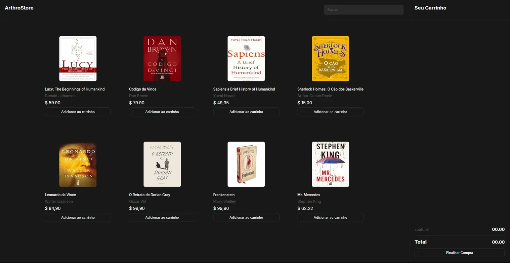

# ArthroStore

> E-commerce concept project — a books store built with vanilla JS.

🔗 Live demo — coming soon

## Built with

- HTML5 + CSS3
- JavaScript (ES6+)
- Vite

## Features

- Product listing with book covers
- Add to cart and remove items
- Real-time subtotal calculation
- Search bar for filtering products

## What I learned

- Managing cart state with vanilla JS
- DOM manipulation and event listeners
- CSS Grid for product layout

---

Made by [Peterson Fernandes](https://github.com/PetersonFernandes)
